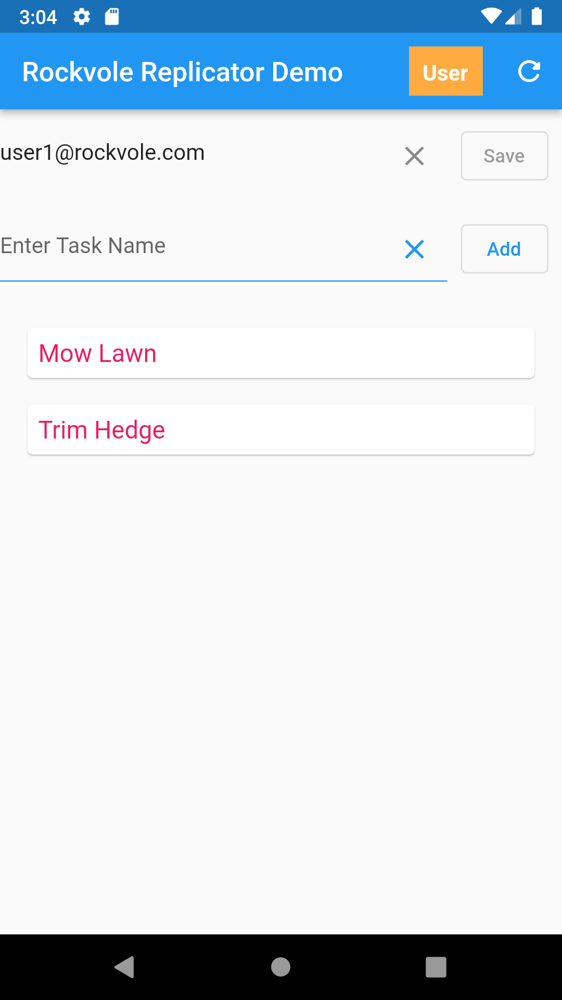

## Add Items to Phone

### Add tasks in app


<hr/>

#### The changes in the phone sqlite database :
```roomsql
select * from task;
2000000000|A. Mow Lawn|0
2000000001|R. Trim Hedge|0
2000000002|I. Water Roses|0
```
<div align="center">Sqllite: Task Table</div><br/>
<i>Note that the id for 'Mow Lawn' is 2000000000 which is in the user space for storing items.</i><br/>
<hr/>

```roomsql
select * from task_TR;
2000000000|A. Mow Lawn|0|2000000000|1|99|278628321|Insert Task|
2000000001|R. Trim Hedge|0|2000000001|1|99|278628330|Insert Task|
2000000002|I. Water Roses|0|2000000002|1|99|278628339|Insert Task|
```
<div align="center">Sqllite: Task Transaction Table</div><br/>
<i>Note that the timestamp for 'Mow Lawn' is 2000000000 which is in the user space for storing items.</i>
<hr/>

### Press Refresh

#### The changes in the phone sqlite database :

```roomsql
select * from task;
1|A. Mow Lawn|0
2|R. Trim Hedge|0
3|I. Water Roses|0
```
<i>Note that the id for 'Mow Lawn' has been changed to 1 since the server has returned a consecutive valid id.</i><br/>
<div align="center">Sqllite: Task Table</div>
<hr/>

```roomsql
select * from task_TR;
1|A. Mow Lawn|0|2000000000|1|99|278628321|Insert Task|
2|R. Trim Hedge|0|2000000001|1|99|278628330|Insert Task|
3|I. Water Roses|0|2000000002|1|99|278628339|Insert Task|
```
<div align="center">Sqllite: Task Transaction Table</div>
<hr/>

```roomsql
select * from water_line;
2000000000|1000|11|0
2000000001|1000|11|0
2000000002|1000|11|0
```
<div align="center">Sqllite: Water Line Table</div><br/>
<i>The WATER_STATE=11 which is CLIENT_SENT.</i>
<hr/>

### Now view the changes on the server :

```roomsql
select * from task;
+----+------------------+---------------+
| id | task_description | task_complete |
+----+------------------+---------------+
|  1 | A. Mow Lawn      |             0 |
|  2 | R. Trim Hedge    |             0 |
|  3 | I. Water Roses   |             0 |
+----+------------------+---------------+
3 rows in set (0.002 sec)
```
<div align="center">MySql: Task Table</div>
<hr/>

```roomsql
select * from task_TR;
+----+------------------+---------------+----+-----------+---------+-----------+-------------+------+
| id | task_description | task_complete | ts | operation | user_id | user_ts   | comment     | crc  |
+----+------------------+---------------+----+-----------+---------+-----------+-------------+------+
|  1 | A. Mow Lawn      |             0 |  5 |         1 |       2 | 278628321 | Insert Task | NULL |
|  2 | R. Trim Hedge    |             0 |  6 |         1 |       2 | 278628330 | Insert Task | NULL |
|  3 | I. Water Roses   |             0 |  7 |         1 |       2 | 278628339 | Insert Task | NULL |
+----+------------------+---------------+----+-----------+---------+-----------+-------------+------+
3 rows in set (0.001 sec)
```
<div align="center">MySql: Task Transaction Table</div>
<hr/>

```roomsql
select * from water_line;
+----------+----------------+-------------+-------------+
| water_ts | water_table_id | water_state | water_error |
+----------+----------------+-------------+-------------+
|        1 |            105 |           1 |           0 |
|        2 |            110 |           1 |           0 |
|        3 |            105 |           1 |           0 |
|        4 |            110 |           1 |           0 |
|        5 |           1000 |           0 |           0 |
|        6 |           1000 |           0 |           0 |
|        7 |           1000 |           0 |           0 |
+----------+----------------+-------------+-------------+
7 rows in set (0.000 sec)
```
<div align="center">MySql: Water Line Table</div><br/>
<i>The water_line table refers to all of the transactions entered into the database so far.</i>

<i>For water_ts=5 the water_state=0 which is SERVER_PENDING, this means the item has not been approved yet and will not be sent to user phones until approval.</i>
