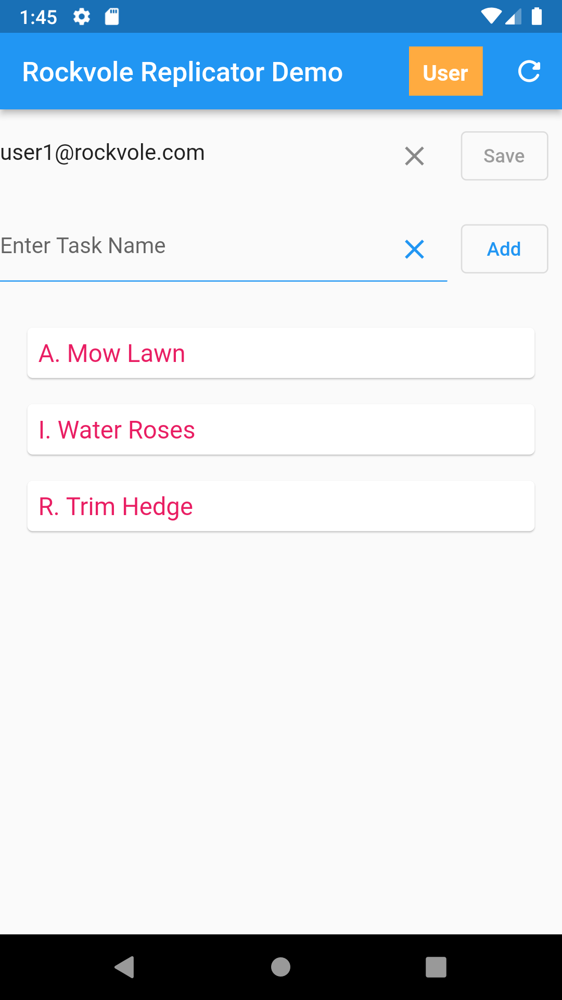

## Add Item to Phone

### Add task in app and press refresh



<hr/>

### The changes in the phone sqlite database :

```roomsql
select * from task;
1|Mow Lawn|0
```
<div align="center">Sqllite: Task Table</div><br/>

```roomsql
select * from task_TR;
1|Mow Lawn|0|2000000000|1|99|277686075|Insert Task|
```
<div align="center">Sqllite: Task Transaction Table</div><br/>
<i>Note that the timestamp for this new entry is 2000000000 which is in the user space for storing items.</i>

```roomsql
select * from water_line;
2000000000|1000|11|0
```
<div align="center">Sqllite: Water Line Table</div><br/>
<i>The WATER_STATE=11 which is CLIENT_SENT.</i>

<hr/>

### Now view the changes on the server :

```roomsql
select * from task;
+----+------------------+---------------+
| id | task_description | task_complete |
+----+------------------+---------------+
|  1 | Mow Lawn         |             0 |
+----+------------------+---------------+
1 row in set (0.000 sec)
```
<div align="center">MySql: Task Table</div><br/>

```roomsql
select * from task_TR;
+----+------------------+---------------+----+-----------+---------+-----------+-------------+------+
| id | task_description | task_complete | ts | operation | user_id | user_ts   | comment     | crc  |
+----+------------------+---------------+----+-----------+---------+-----------+-------------+------+
|  1 | Mow Lawn         |             0 |  5 |         1 |       2 | 277686075 | Insert Task | NULL |
+----+------------------+---------------+----+-----------+---------+-----------+-------------+------+
1 row in set (0.000 sec)
```
<div align="center">MySql: Task Transaction Table</div><br/>

```roomsql
select * from water_line;
+----------+----------------+-------------+-------------+
| water_ts | water_table_id | water_state | water_error |
+----------+----------------+-------------+-------------+
|        1 |            105 |           1 |           0 |
|        2 |            110 |           1 |           0 |
|        3 |            105 |           1 |           0 |
|        4 |            105 |           1 |           0 |
|        5 |           1000 |           0 |           0 |
+----------+----------------+-------------+-------------+
5 rows in set (0.001 sec)
```
<div align="center">MySql: Water Line Table</div><br/>
<i>The water_line table refers to all of the transactions entered into the database so far.</i>

<i>For water_ts=5 the water_state=0 which is SERVER_PENDING, this means the item has not been approved yet and will not be sent to user phones until approval.</i>
