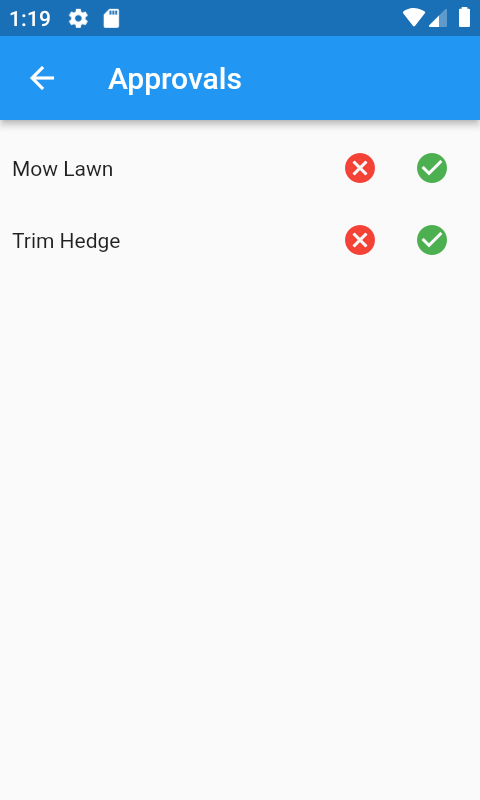

## Admin Approve / Reject

### Press the Clear Water Line button and then press refresh on the phone

<i>We now go to the Approvals page and press the Clear Water Line button (this button is for demonstration purposes only). This means that now when we refresh we will request all records from the first timestamp.</i>
<i>We do this in the demo app because the admin user has been created after the items were created by user1, so without a way to reset the water_line back to 0 we will not see the older items.</i>

<i>In your app you could clear the water line automatically after an admin upgrade. Or if your admin user is created early it will not be an issue.</i>

### Choose whether to Approve or Reject



<i>We will Approve 'Mow Lawn', Reject 'Trim Hedge' and Ignore 'Water Roses'.</i>
<hr/>

### Now press refresh and then view the changes on the server :

```roomsql
select * from task;
+----+------------------+---------------+
| id | task_description | task_complete |
+----+------------------+---------------+
|  1 | A. Mow Lawn      |             0 |
|  3 | I. Water Roses   |             0 |
+----+------------------+---------------+
2 rows in set (0.000 sec)
```
<div align="center">MySql : Task Table</div>

<i>Trim Hedge is no longer in the task table</i>
<hr/>

```roomsql
select * from task_TR;
+----+------------------+---------------+----+-----------+---------+-----------+-------------+------+
| id | task_description | task_complete | ts | operation | user_id | user_ts   | comment     | crc  |
+----+------------------+---------------+----+-----------+---------+-----------+-------------+------+
|  3 | I. Water Roses   |             0 |  7 |         1 |       2 | 279992072 | Insert Task | NULL |
|  1 | A. Mow Lawn      |             0 | 11 |         1 |       2 | 279992047 | Insert Task | NULL |
|  2 | R. Trim Hedge    |             0 | 12 |         1 |       2 | 279992061 | Insert Task | NULL |
+----+------------------+---------------+----+-----------+---------+-----------+-------------+------+
3 rows in set (0.000 sec)
```
<div align="center">MySql : Task Transaction Table</div>

<i>In transaction tables, the ts column corresponds to the water_ts in the water_line table.</i>
<hr/>

```roomsql
select * from water_line;
+----------+----------------+-------------+-------------+
| water_ts | water_table_id | water_state | water_error |
+----------+----------------+-------------+-------------+
|        1 |            105 |           1 |           0 |
|        2 |            110 |           1 |           0 |
|        3 |            105 |           1 |           0 |
|        4 |            110 |           1 |           0 |
|        7 |           1000 |           0 |           0 |
|        8 |            105 |           1 |           0 |
|        9 |            110 |           1 |           0 |
|       10 |            105 |           1 |           0 |
|       11 |           1000 |           1 |           0 |
|       12 |           1000 |           2 |           0 |
+----------+----------------+-------------+-------------+
10 rows in set (0.000 sec)
```
<div align="center">MySql : Water Line Table</div>
<i>Where water_ts = 7, the water_state is 0 which corresponds to SERVER_PENDING</i>

<i>Where water_ts = 12, the water_state is 2 which corresponds to SERVER_REJECTED</i>
<hr/>
