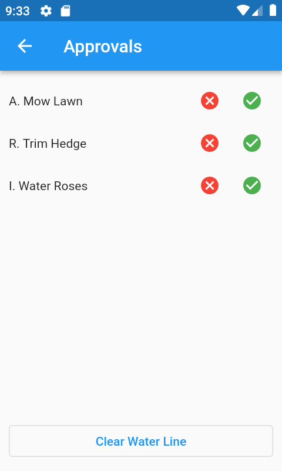

## Admin Approve / Reject

### Choose whether to Approve or Reject



<i>We will Approve 'Mow Lawn', Reject 'Trim Hedge' and Ignore 'Water Roses'.</i>
<hr/>

### Now press refresh and then view the changes on the server :

```roomsql
select * from task;
+----+------------------+---------------+
| id | task_description | task_complete |
+----+------------------+---------------+
|  1 | A. Mow Lawn      |             0 |
|  3 | I. Water Roses   |             0 |
+----+------------------+---------------+
2 rows in set (0.000 sec)
```
<div align="center">MySql : Task Table</div>

<i>Trim Hedge is no longer in the task table</i>
<hr/>

```roomsql
select * from task_TR;
+----+------------------+---------------+----+-----------+---------+-----------+-------------+------+
| id | task_description | task_complete | ts | operation | user_id | user_ts   | comment     | crc  |
+----+------------------+---------------+----+-----------+---------+-----------+-------------+------+
|  3 | I. Water Roses   |             0 |  7 |         1 |       2 | 278628339 | Insert Task | NULL |
|  1 | A. Mow Lawn      |             0 | 11 |         1 |       2 | 278628321 | Insert Task | NULL |
|  2 | R. Trim Hedge    |             0 | 12 |         1 |       2 | 278628330 | Insert Task | NULL |
+----+------------------+---------------+----+-----------+---------+-----------+-------------+------+
3 rows in set (0.000 sec)
```
<div align="center">MySql : Task Transaction Table</div>

<i>In transaction tables, the ts column corresponds to the water_ts in the water_line table.</i>
<hr/>

```roomsql
select * from water_line;
+----------+----------------+-------------+-------------+
| water_ts | water_table_id | water_state | water_error |
+----------+----------------+-------------+-------------+
|        1 |            105 |           1 |           0 |
|        2 |            110 |           1 |           0 |
|        3 |            105 |           1 |           0 |
|        4 |            110 |           1 |           0 |
|        7 |           1000 |           0 |           0 |
|        8 |            105 |           1 |           0 |
|        9 |            110 |           1 |           0 |
|       10 |            105 |           1 |           0 |
|       11 |           1000 |           1 |           0 |
|       12 |           1000 |           2 |           0 |
+----------+----------------+-------------+-------------+
10 rows in set (0.010 sec)
```
<div align="center">MySql : Water Line Table</div>
<i>Where water_ts = 7, the water_state is 0 which corresponds to SERVER_PENDING</i>

<i>Where water_ts = 12, the water_state is 2 which corresponds to SERVER_REJECTED</i>
<hr/>
