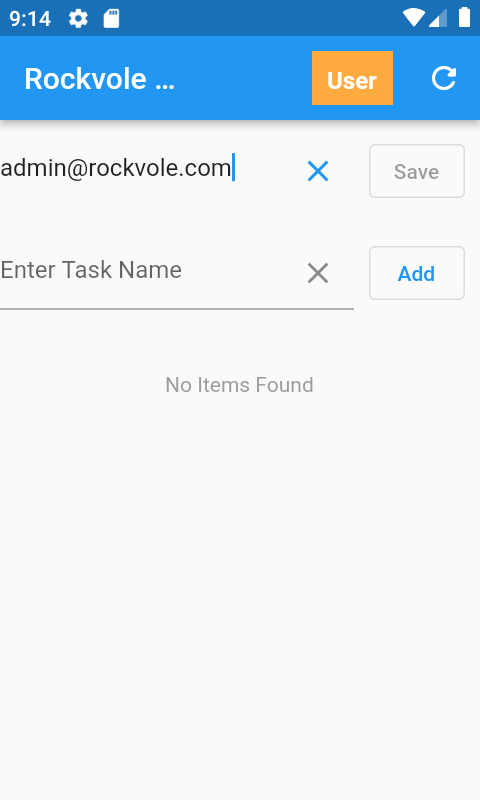

## Create Admin Phone

### Save user and refresh


<hr/>

### On server, we upgrade the user to admin

```shell
./rockvole_helper.sh upgradeuser admin@rockvole.com
```
<div align="center">Command Line</div>
<hr/>

### Database is shown which reflects the changes

```roomsql
select * from user;
+----+----------------------+--------+--------+---------------------+---------------+
| id | pass_key             | subset | warden | request_offset_secs | registered_ts |
+----+----------------------+--------+--------+---------------------+---------------+
|  1 | 41004347aa0310209084 |      1 |      1 |                   0 |             0 |
|  2 | 40259a               |      0 |      7 |                9453 |     277683963 |
|  3 |                      |      0 |      5 |               21501 |     278026768 |
+----+----------------------+--------+--------+---------------------+---------------+
3 rows in set (0.000 sec)
```
<div align="center">Mysql: User Table</div>

<i>In user table, our new user is id=3. Warden is now 5 which is ADMIN</i>

<i>The pass_key has been cleared so that on the next request a new admin pass_key will be generated.</i>
<hr/>

```roomsql
select * from user_store;
+----+--------------------+--------------+------+---------+--------------------+------------------------+----------------------+
| id | email              | last_seen_ts | name | surname | records_downloaded | changes_approved_count | changes_denied_count |
+----+--------------------+--------------+------+---------+--------------------+------------------------+----------------------+
|  1 | write@rockvole.com |            0 | NULL | NULL    |                  0 |                      0 |                    0 |
|  2 | user1@rockvole.com |    277683963 | NULL | NULL    |                  0 |                      0 |                    0 |
|  3 | admin@rockvole.com |    278026768 | NULL | NULL    |                  0 |                      0 |                    0 |
+----+--------------------+--------------+------+---------+--------------------+------------------------+----------------------+
3 rows in set (0.000 sec)
```
<div align="center">Mysql: User Store Table</div>
<hr/>

### Press refresh and Admin user is now Admin


<hr/>

### User table now contains admin password

```roomsql
select * from user;
+----+----------------------+--------+--------+---------------------+---------------+
| id | pass_key             | subset | warden | request_offset_secs | registered_ts |
+----+----------------------+--------+--------+---------------------+---------------+
|  1 | 41004347aa0310209084 |      1 |      1 |                   0 |             0 |
|  2 | 40259a               |      0 |      7 |                9453 |     277683963 |
|  3 | 83902a1387aa56aaa7a1 |      0 |      5 |               21501 |     278026768 |
+----+----------------------+--------+--------+---------------------+---------------+
3 rows in set (0.001 sec)
```
<div align="center">Mysql: User Table</div>

