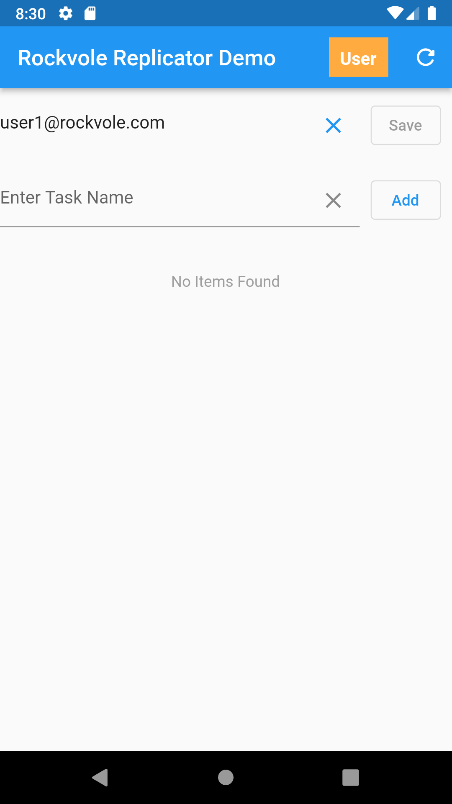

## Create User 1

### Add email address in app and press refresh


<hr/>

### Now view the changes on the server :

```roomsql
select * from user;
+----+----------------------+--------+--------+---------------------+---------------+
| id | pass_key             | subset | warden | request_offset_secs | registered_ts |
+----+----------------------+--------+--------+---------------------+---------------+
|  1 | 9101025213a41aaa2a21 |      1 |      1 |                   0 |             0 |
|  2 | 1a09a1               |      0 |      7 |                2278 |     278628118 |
+----+----------------------+--------+--------+---------------------+---------------+
2 rows in set (0.001 sec)
```
<div align="center">MySql: User Table</div>
<hr/>

```roomsql
select * from user_TR;
+----+----------------------+--------+--------+---------------------+---------------+----+-----------+---------+---------+--------------------+------+
| id | pass_key             | subset | warden | request_offset_secs | registered_ts | ts | operation | user_id | user_ts | comment            | crc  |
+----+----------------------+--------+--------+---------------------+---------------+----+-----------+---------+---------+--------------------+------+
|  1 | 9101025213a41aaa2a21 |      1 |      1 |                   0 |             0 |  1 |         1 |      33 |    NULL | Insert into User   |    0 |
|  2 | 1a09a1               |      0 |      7 |                2278 |             0 |  3 |         1 |       0 |    NULL | Inserting new user | NULL |
+----+----------------------+--------+--------+---------------------+---------------+----+-----------+---------+---------+--------------------+------+
2 rows in set (0.001 sec)
```
<div align="center">MySql: User Transaction Table</div>
<hr/>

```roomsql
select * from user_store;
+----+--------------------+--------------+------+---------+--------------------+------------------------+----------------------+
| id | email              | last_seen_ts | name | surname | records_downloaded | changes_approved_count | changes_denied_count |
+----+--------------------+--------------+------+---------+--------------------+------------------------+----------------------+
|  1 | write@rockvole.com |            0 | NULL | NULL    |                  0 |                      0 |                    0 |
|  2 | user1@rockvole.com |    278628118 | NULL | NULL    |                  0 |                      0 |                    0 |
+----+--------------------+--------------+------+---------+--------------------+------------------------+----------------------+
2 rows in set (0.000 sec)
```
<div align="center">MySql: User Store Table</div>
<hr/>

```roomsql
select * from user_store_TR;
+----+--------------------+--------------+------+---------+--------------------+------------------------+----------------------+----+-----------+---------+---------+------------------------+------+
| id | email              | last_seen_ts | name | surname | records_downloaded | changes_approved_count | changes_denied_count | ts | operation | user_id | user_ts | comment                | crc  |
+----+--------------------+--------------+------+---------+--------------------+------------------------+----------------------+----+-----------+---------+---------+------------------------+------+
|  1 | write@rockvole.com |            0 | NULL | NULL    |                  0 |                      0 |                    0 |  2 |         1 |      33 |    NULL | Insert into User Store |    0 |
|  2 | user1@rockvole.com |    278628118 | NULL | NULL    |                  0 |                      0 |                    0 |  4 |         1 |       0 |    NULL | Inserting new user     | NULL |
+----+--------------------+--------------+------+---------+--------------------+------------------------+----------------------+----+-----------+---------+---------+------------------------+------+
2 rows in set (0.000 sec)
```
<div align="center">MySql: User Store Transaction Table</div><br/>
