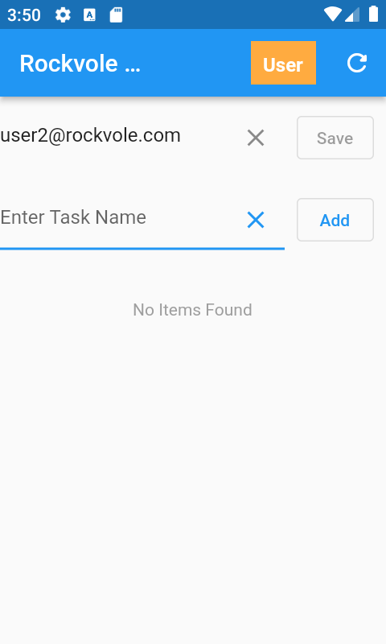

## Create User 2

### Add email address in app and press refresh


<div align="center">There are no items to view</div>
<hr/>

```roomsql
select * from task;
```
<div align="center">No rows returned</div>