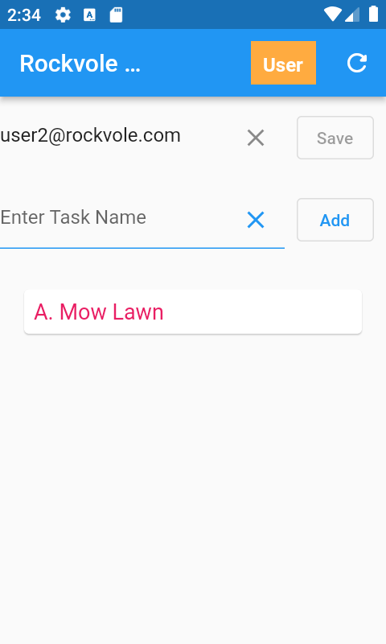

## Create User 2

### Add email address in app and press refresh


<div align="center"></div>
<hr/>

```roomsql
select * from task;
id |task_description |task_complete
1  |A. Mow Lawn      |0
```
<div align="center">Sqllite : Task Table</div>

<i>You can see that only the approved item 'Mow Lawn' has been sent to the User 2 phone.</i>
